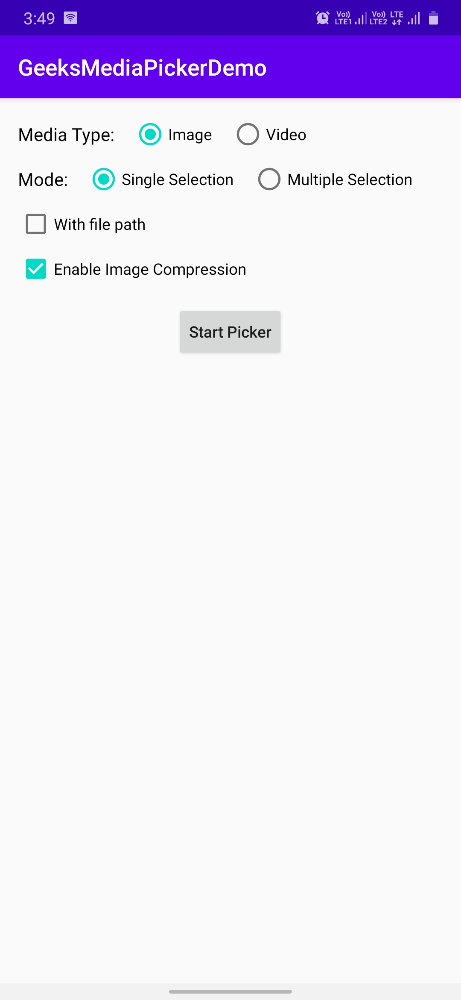
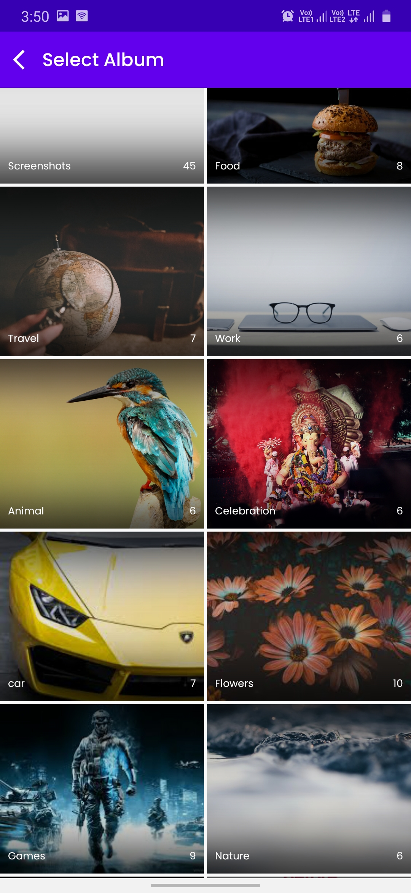
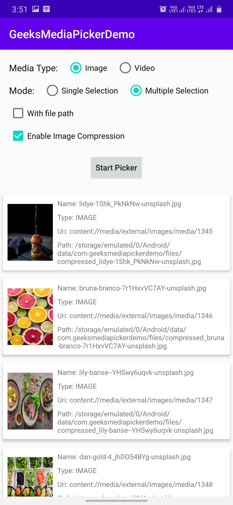

# GeeksMediaPicker
GeeksMediaPicker is a **simple media picker** library for Android.

- Support Image/Video types.
- Support Single/Multiple select.
- Support ImageCompression.
- Competible with Android 10 and above.
- You can get real path of a selected media (it will copy selected file to your app's package storage and returned that path).


|       Demo App          |    Select Album         |    Select Media         |       Get Result         |
|:-----------------------:|:-----------------------:|:-----------------------:|:-----------------------: |
|  |  |  |   |

</br>

## Setup

### Gradle

```gradle

- Project level gradle
repositories {
    maven { url "https://jitpack.io" }
}

- App level gradle file
dependencies {
    //GeeksMediaPicker
    implementation 'com.github.im-manisharma:GeeksMediaPicker:1.0.0'
}

```

</br></br>

## How to use it

### 1. Enable databinding

- GeeksMediaPicker uses databinding
- Set enable databinding in your app `build.gradle`

```
dataBinding {
    enabled = true
}
```

</br>


### 2. Let's Start GeeksMediaPicker

- GeeksMediaPicker uses Interfaces and Lambda {()->Unit} callback so you don't need to use startActivityForResult to get selected Media files
- You can call GeeksMediaPicker from Activity and Fragment.

</br>

#### To Get Single Media File


##### For Image

```
GeeksMediaPicker.with(this)
     .setMediaType(GeeksMediaType.IMAGE)
     .startSingle { mediaStoreData ->
            val imageUri = mediaStoreData.content_uri
            //Now use this uri to load image
      }
```

##### For Video


```
GeeksMediaPicker.with(this)
     .setMediaType(GeeksMediaType.VIDEO)
     .startSingle { mediaStoreData ->
            val videoUri = mediaStoreData.content_uri
            //Now use this uri to play video
            
            //To get video duration (in milliseconds)
            val videoDuration = mediaStoreData.media_duration
      }
```


</br>

#### To Get Multiple Media Files


##### For Image

```
GeeksMediaPicker.with(this)
     .setMediaType(GeeksMediaType.IMAGE)
     .startMultiple { mediaStoreDataList ->
            //Now use this list to get images uri
      }
```

##### For Video


```
GeeksMediaPicker.with(this)
     .setMediaType(GeeksMediaType.VIDEO)
     .startMultiple { mediaStoreDataList ->
            //Now use this list to get video uri and video duration
      }
```

</br>

### 3. GeeksMediaPicker Return Type

##### MediaStoreData Class

- It will return MediaStoreData class object
- You can use this object to get all required information i.e.
- Fields of MediaStoreData class

```
media_name: String      : Name of the selected media file.
media_type: String      : Type of the selected media file.
bucket_name: String?    : Album name of the selected media file, null if it is not belongs to any Album.
content_uri: Uri?       : Original MediaStore Uri of the selected file
media_path: String      : Real Path of the selected file   
media_duration: Long    : Duration of the selected media for Video file
```


</br>

### 4. GeeksMediaPicker Customization

- For now it is only support change toolbar color by calling e.g.

```
GeeksMediaPicker.with(this)
     .setMediaType(GeeksMediaType.IMAGE)
     .setToolbarColor(YOUR_COLOR)   // It should be an Integer value
     .startSingle { mediaStoreData ->
            val imageUri = mediaStoreData.content_uri
            //Now use this uri to load image
      }
```

</br>


### 5. To Get Media File Path

#### For Real Path (Without compression works for all types of MediaType)

```
GeeksMediaPicker.with(this)
     .setMediaType(GeeksMediaType.IMAGE)
     .setIncludesFilePath(true)
     .startSingle { mediaStoreData ->
            val filePath = mediaStoreData.media_path
      }
```


#### For Compressed File Path (Works only for GeeksMediaType.IMAGE)

```
GeeksMediaPicker.with(this)
     .setMediaType(GeeksMediaType.IMAGE)
     .setEnableCompression(true)
     .startSingle { mediaStoreData ->
            // you will receive compressed path in same key used for real file path
            val compressedFilePath = mediaStoreData.media_path 
      }
```


</br>

### 6. All Public Functions

* `setMediaType(MediaType)` : (default value)GeeksMediaType.IMAGE / GeeksMediaType.IMAGE
* `setToolbarColor(Color.Blue)` : (default theme color)
* `setIncludesFilePath(Boolean)` : (default false) // if true you can get real file path of selected media file from {mediaStoreData.media_path}.
* `setEnableCompression(Boolean)` : (default false) // if true it will compress all selected Images and return their path in {mediaStoreData.media_path}.

</br>

### 7. Incoming improvements

- Set Maximum And Minimum Number Of Selection
- Click Image From Camera Support
- Record Video From Camera Support.
- Add Support for Pdf and Audio file.
- More customization will be added in next release.


</br></br>

## License

````code
MIT License

Copyright (c) 2020 Manish Sharma

Permission is hereby granted, free of charge, to any person obtaining a copy
of this software and associated documentation files (the "Software"), to deal
in the Software without restriction, including without limitation the rights
to use, copy, modify, merge, publish, distribute, sublicense, and/or sell
copies of the Software, and to permit persons to whom the Software is
furnished to do so, subject to the following conditions:

The above copyright notice and this permission notice shall be included in all
copies or substantial portions of the Software.

THE SOFTWARE IS PROVIDED "AS IS", WITHOUT WARRANTY OF ANY KIND, EXPRESS OR
IMPLIED, INCLUDING BUT NOT LIMITED TO THE WARRANTIES OF MERCHANTABILITY,
FITNESS FOR A PARTICULAR PURPOSE AND NONINFRINGEMENT. IN NO EVENT SHALL THE
AUTHORS OR COPYRIGHT HOLDERS BE LIABLE FOR ANY CLAIM, DAMAGES OR OTHER
LIABILITY, WHETHER IN AN ACTION OF CONTRACT, TORT OR OTHERWISE, ARISING FROM,
OUT OF OR IN CONNECTION WITH THE SOFTWARE OR THE USE OR OTHER DEALINGS IN THE
SOFTWARE.
````
